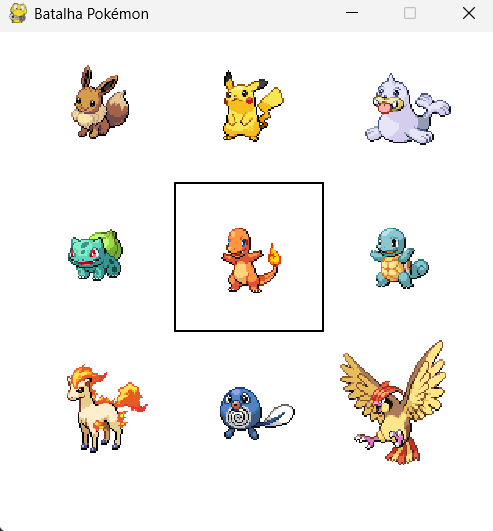
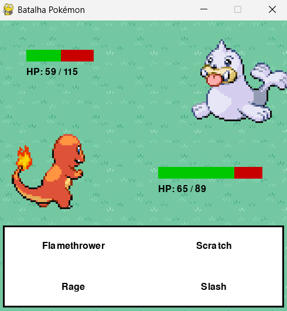

# Pokemon-Interactive-Game
  Projeto Final da disciplina de raciocínio algorítmico, que era preciso criar um programa com interfaces Gráficas em Python, Feito em dupla.
  ## Pokemon-Interactive-Game é um jogo que tem elementos clássicos do universo Pokémon, usando Pygame, Customtkinter e pandas, oferecendo batalhas empolgantes, e até mesmo um segredo, será que você será capaz de encontralo?  

# Funcionalidades:
  * Batalhas Pokémon
  * Interface gráfica com CustomTkinter
  * Integração com PokéAPI para dados em tempo real
  * Animações dinâmicas com Pygame
  * Música durante o jogo todo
  * Leitura de arquivos .csv com pandas
  * Escrita de arquivo .txt

# Tecnologias:
  * Pandas
  * Pygame
  * Customtkinter
  * PokéAPI

# Capturas de Tela:
  ### Seleção de Pokémon
  

  ### Batalha
  

# Manual de "Utilização"  e "Requisitos" estão na pasta "Documentos"

  
